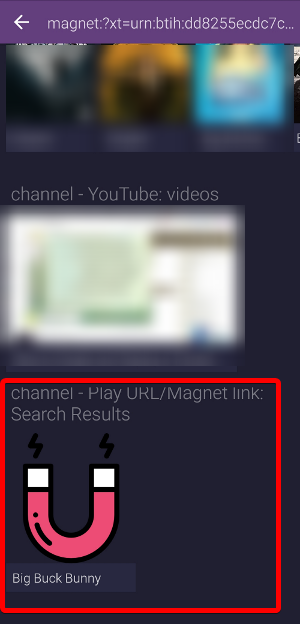
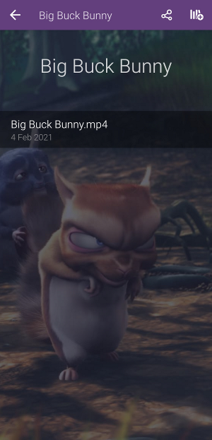

# magnet-player
Play magnet links or URLs directly in Stremio. This is already a built-in feature on the Stremio desktop app, but not on Android.

## Usage
1. Paste a magnet link or URL pointing to a media file (e.g. url ending with `.mp4`) into the search bar.
2. Wait for the addon to parse your content. Please be patient as this could take a while. On Stremio desktop this would show some kind of loading screen, but on Android no such thing exists yet so it might look like it's not working. You should only be concerned if your stream doesn't load after +- 60 seconds of waiting. If it doesn't load BUT the same URL works fine on the desktop version of Stremio, please open [an issue](https://github.com/sleeyax/stremio-addons/issues) on this repository.
3. Tap the first result from the `channel - Play URL/Magnet link Search Results` catalog. Thumbnails or other graphics might take a little longer to load too, but your content should now be available instantly!

## Supported links
* Any magnet link, as long as its properly formatted (it should start with '`magnet:`')
* HTTP(S) URL ending and responding with media content of type: '`.mkv`', '`.avi`', '`.mp4`', '`.wmv`', '`.vp8`', '`.mov`', '`.mpg`', '`.mp3`' or '`.flac`'

## Screenshots

