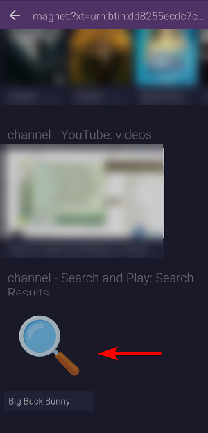
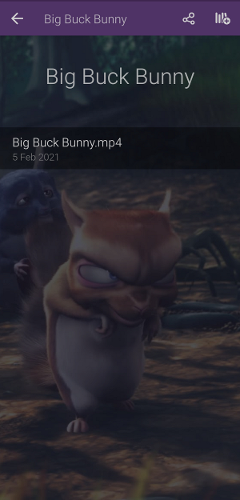

# Search and Play
Find and play content from magnet links, URLs, info hashes [and more](#supported-links) directly in Stremio by pasting them in the search bar. This addon was developed with Android in mind, but features that are not already built into Stremio desktop (such as `Play URL/Magnet link`) work on desktop too!

## Usage
1. Paste a [supported link](#supported-links) such as a magnet link or media URL into the search bar.
2. Wait for the addon to parse/load your content through its catalog. 
3. Choose your content from the `Search and Play` catalog. Happy watching!

## Supported links
* Any magnet link
* HTTP(S) URL ending and responding with media content of type: `.torrent`, `.mkv`, `.avi`, `.mp4`, `.wmv`, `.vp8`, `.mov`, `.mpg`, `.mp3` or `.flac`
* Info hash (case insensitive) e.g: `a3fbda1961fbc908026ec7cc4569d5fbef840c1e`
* [IMDB](https://www.imdb.com) ID e.g: `tt1254207`

## FAQ
**My link isn't working**

Some links like magnet links might take a while to load, because they need to be parsed (when not cached yet). I can't force any kind of loading screen to show either so you should only be concerned if the catalog doesn't load after +- 60 seconds of waiting. If it still doesn't load BUT the same link works fine when pasted in the desktop version of Stremio, please open [an issue](https://github.com/sleeyax/stremio-addons/issues) on this repository.

**But you can also open a magnet link by clicking it from a browser and selecting 'open in Stremio' though?**

Yes that's possible, but the default magnet link opener on Android is rather basic and doesn't always include nice visuals such as the actual title of the media and background image :) Besides that, this addons support many more types of links!

## Screenshots

